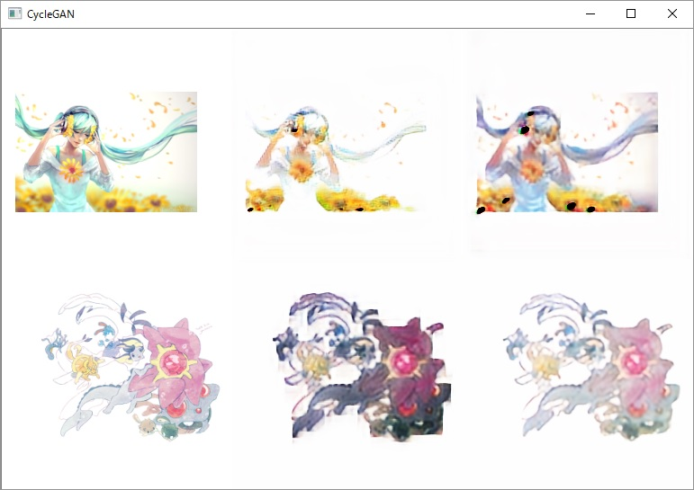

gantest
===
Chainerによる学習処理の叩き台。  
現状CycleGANとpix2pixが入ってます。
pix2pixは現状途中です。

## Description
CNNを試そうとすると大体同じような処理になるので、  
色々なパターンに対応できる叩き台が欲しいと思い作りました。

pix2pixは [https://github.com/pfnet-research/chainer-pix2pix](https://github.com/pfnet-research/chainer-pix2pix) を参考に、  
CycleGANは [https://github.com/Aixile/chainer-cyclegan](https://github.com/Aixile/chainer-cyclegan) を参考にさせて頂きました。  
有用なコードを有難うございます。

## Demo
学習経過のデモサイトは[こちら](http://www.nquantums.net/dnn/)。  
いつ止めるかわかりません。

## Requirement
- [Anaconda3](https://www.continuum.io/downloads) 4.2 [Windows 64bit](https://repo.continuum.io/archive/Anaconda3-4.2.0-Windows-x86_64.exe) / 
 [32bit](https://repo.continuum.io/archive/Anaconda3-4.2.0-Windows-x86.exe)、[Linux 64bit](https://repo.continuum.io/archive/Anaconda3-4.2.0-Linux-x86_64.sh) / [32bit](https://repo.continuum.io/archive/Anaconda3-4.2.0-Linux-x86.sh)、[MacOS X](https://repo.continuum.io/archive/Anaconda3-4.2.0-MacOSX-x86_64.sh)  
- [CUDA8](https://developer.nvidia.com/cuda-downloads) ※ChainerでGPU使うなら必要
- [cuDNN5](https://developer.nvidia.com/cudnn) ※ChainerでGPU使うなら必要
- VisualStudio2015 ※CPythonやらCUDAコンパイラで必要になる
- [Chainer](https://github.com/pfnet/chainer) 1.23
- OpenCV3

## Usage
１．まずデータセットを作ります。  
※ imagesDir には*.jpg,*.png が入ったディレクトリを指定します。
※ 現状では datasets/cyclegan ディレクトリ内に通常背景と白背景画像に分けて作成されます。

	python ./buildds.py CycleGAN imagesDir

２．学習を実行します。
※ 実行すると学習経過の画像が表示されます、なんとなく眺めていると面白かったので。

	python ./train.py CycleGAN

## Contribution

## Licence

[MIT](./LICENSE)

## Author

[nQuantums](https://github.com/nQuantums)
